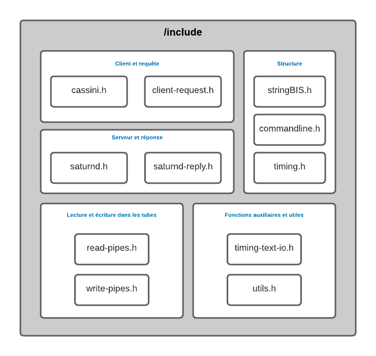
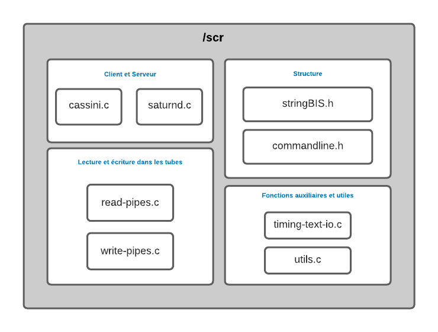

# SYSTÈME D'EXPLOITATION 2021 - 2022

## Sommaire
1. [Fonctionnalités](README.md#fonctionnalités)
2. [Architecture](README.md#architecture)
3. [Stratégie adoptée et structure logicielle](README.md#stratégie-adoptée-et-structure-logicielle)

----------------------------------------------------------------------


## Fonctionnalités

Ce projet a pout but de programmer un couple démon-client permettant à un utilisateur d'automatiser l'exécution périodique de tâches à des moments spécifiés. Le rôle du démon, saturnd, consiste à exécuter les tâches définies par le client. Pour cela, il attend les requêtes du client, cassini, et y répond en exécutant les tâches aux dates demandées.

Voilà une liste que le client, cassini, peut envoyer au démon :

1. Liste toutes les tâches.
2. Crée une nouvelle tâche.
3. Supprime une tâche.
4. Liste l'heure d'exécution et la valeur de retour de toutes les exécutions précédentes de la tâche.
5. Affiche la sortie standard de la dernière exécution de la tâche.
6. Affiche la sortie erreur standard de la dernière exécution de la tâche.
7. Termine le démon.


## Architecture

** Schéma permettant de comprendre l'architecture des fichiers principaux :**





## Stratégie adoptée et structure logicielle


**Première étape : L'écriture des structures et des types**

La première chose qu'on a fait pour réaliser ce projet, c'est de construire les structures du fichier `protocole.md`. On a ainsi créer la structure `commandline` et `string` (respectivement dans les fichiers `commandline.h` et `stringBIS.h`). (Le nom du fichier `stringBIS.h` a été écrit de cette manière parce qu'il y avait déjà un type `string` prédéfini
On a écrit nos structures ainsi :

*Pour commandline : le paramètre `argc` représente le nombre d'arguments et le paramètre `argv` est un tableau des arguments*
```
typedef struct commandline {
	uint32_t argc;
	string *argv;
} commandline;
```

*Pour string : le paramètre `len` représente le nombre de caractère de `word`*
```
typedef struct string {
	uint32_t len;
	char *word;
} string;
```


**Deuxième étape : L'écriture des requêtes et la lecture des réponses du client (cassini)**

Pour les requêtes du client, les premières tentatives ont été faites avec les tests donnés. On a alors commencé par écrire les fonctions pour écrire les requêtes dans les tubes de requête. On a ainsi créer toutes les fonctions du type `write_request_[...]`. Et ensuite on a écrit les fonctions pour lire les réponses du serveur dans les tubes de réponse (`read_request_[...]`).

En fonction de l'opération de l'utilisateur, le client va envoyer la bonne opération dans le tube de requête.


**Troisième étape : La lecture et l'écriture des réponses du serveur (saturnd)**

Pour les réponses du serveur, on a crée un serveur indépendant (qui avait besoin d'un terminal propre).
On devait alors lancer le serveur sur un terminal. Puis les requêtes du client sur un deuxième terminal.

Ensuite, on a alors commencé par écrire les fonctions pour lire les requêtes dans les tubes de requête. On a ainsi créer toutes les fonctions du type `read_reply_[...]`. Et ensuite on a écrit les fonctions pour écrire les réponses du serveur dans les tubes de réponse (`write_reply_request_[...]`).


----------------------------------------------------------------------